# Goods purchasing ecosystem project

#### Author: Andrei Marchenko <ftkvyn@gmail.com>, @ftkvyn, [LinkedIn](https://www.linkedin.com/in/ftkvyn/)

#### Profile on [forum.freeton.org](https://forum.freeton.org/u/ftkvyn/)

### * FreeTON network support is in the development.

## Short description

The goal of the project is to create an ecosystem for selling and purchasing goods on TON blockchain. The general idea is following. There are the **Sellers** each of whom is selling some goods. Each of the **Sellers** has it's list of the goods that he sells. The **Seller** accepts the requests from the **Buyers** as internal messages. Then the **Seller** may estimate inspect his stores and warehouses (offline) and send back to the **Buyer** the response with the price estimation for the requested set of goods. If the seller doesn't have enough goods in the store - he may specify the amount of each product that he proposes. When the **Buyer** got the price estimations from different **Sellers**, he may pay for the proposed goods.

Each price request and response has it's expiration time - after it it won't be possible to send the request and it's not possible to pay for the outdated price estimation. It allows to put some deadlines - the **Buyer** knows after what date he shouldn't wait for the response any more and the **Seller** may reserve the products for the buyer when giving back the price, but he'll reserve them only for the limited period of time. It also allows to clean up the smart contracts storage from time to time removing outdated entiries.

Some precautions to avoid flooding of the sellers are made. First, the seller may just close the store - then no new requests will be accepted. Second - the seller may set a price for accepting price request. It will allow to cut out the "spam" requests that are not really intended to buy anything and just waste storage and processing time.

For now for the technical reasons the **Buyers** and **Sellers** contracts have to be in the same workchain to be able to communicate.

Each seller and buyer stores it's name or short description in the blockchain to simplify the identification for the other parties.

## Use cases

1.	The small local stores that sell automobile parts are ordering some parts from different big producers of those parts.
1.	Local (city or district) governments may purchase goods and services from private companies.
1.	Others.

## Components

### On-chain

Following instruments are working on TON blockchain:

*	Smartcontract (FreeTON version, Solidity)
	*	**seller.sol** - Solidity source code of the **Seller** contract. Accepts requests from **Buyers**, sends back the prices. Maintains the list of products.
	*	**buyer.sol** - Solidity source code of the **Buyer** contract. Creates price requests, sends them to **Sellers**, gets back the quotas, may as well pay the estimated quota.
*	Smartcontracts
	*	**seller.fc** - the **Seller's** smart contract. Stores list of goods, accepts price requests from the **Buyers**, sends back price estimations, accepts payments for estimated requests.
	*	**buyer.fc** - the **Buyer's** smart contract. Stores created orders, sends once created orders to several **Sellers**, accepts price estimation from them and pays the estimated price.
	*	**common.fc** - some common code parts for both seller.fc and buyer.fc.
*	Fift scripts (seller)
	*	**new-seller.fif** - creates new seller contract. It's possible to provide the initial list of the products that the seller sells. Each product is identified by it's **ID**, no more information about the product is stored in the blockchain, the product information should be stored off-chain or on some different, informational, smart contracts.
	*	**price-response.fif** - creates response for recieved request
	*	**edit-goods.fif** - add or remove the product id
	*	**open-close-seller.fif** - open or close the store
*	Fift scripts (buyer)
	*	**new-buyer.fif** - creates new buyer contract.
	*	**price-request-create.fif** - creates a new price request that may be later sent to the **Sellers**
	*	**price-request-send.fif** - sends the previously created request to the selected **Seller**
	*	**pay-for-request.fif** - pay the price for the previously recieved price estimation
*	Fift scripts (common)
	*	**key-update.fif** - updates stored key - may be used to transfer the ownership of the contract
	*	**cleanup-expired.fif** - starts clean up process that removes all expired entries.
	*	**send-grams.fif** - sends provided amount of grams to any other address (as in simple wallet)


### Off-chain (Only for Classic TON, FreeTON is not yet supported)

* Seller's application
	* Allows to create several **Seller** contracts, observe recieved price requests, send back price estimations.

* Buyer's application
	* Allows to create several **Buyer** contracts, create new price requests, send them to the sellers, observe recieved price estimations.

## Requirements (FreeTON)

Applications are developed and tested on Ubuntu Linux, correct work on other systems is not guaraneed.
To be able to build and run scripts and to be able to use teacher's and student's application following requirements have to be fulfilled:

* Download or build from sources FreeTON tools - Solidity compiler and `tvm_linker` as described in the instruction:
	*	Solidity tools for FreeTON: [https://docs.ton.dev/86757ecb2/p/950f8a-write-smart-contract-in-solidity](https://docs.ton.dev/86757ecb2/p/950f8a-write-smart-contract-in-solidity)
	*	General FreeTON tools: [https://docs.ton.dev/86757ecb2/p/552389-general](https://docs.ton.dev/86757ecb2/p/552389-general)
	*	Solidity to TON compiler: [https://github.com/tonlabs/TON-Solidity-Compiler](https://github.com/tonlabs/TON-Solidity-Compiler)
	*	`tvm_linker`: [https://github.com/tonlabs/TVM-linker](https://github.com/tonlabs/TVM-linker)
	*	Useful tookit for communitcation with TON - tonos-cli [https://github.com/tonlabs/tonos-cli](https://github.com/tonlabs/tonos-cli)

## Build instructions (FreeTON)

*TBD*

## Requirements

Applications are developed and tested on Ubuntu Linux, correct work on other systems is not guaraneed.
To be able to build and run scripts and to be able to use seller's and buyer's applications following requirements have to be fulfilled:

* Build TON libraries (`lite-client`, `fift` and `func`) as described in the instruction on [https://test.ton.org/](https://test.ton.org/);
* Set up correct `FIFTPATH`;
* Set up links to `fift` and `func` so that they can be used from the command line.
* For now the applications save their generated files (private keys, contract addresses and .boc files to upload to the blockchain) to the directory from which they are runned, so they need to have write permissions for their directories.

## Build instructions

### Crypto

To build fift scripts from sources, run

```
./build-crypto.sh
```

### Applications

Enter the application folder, `/src/seller-app` or `/src/buyer-app`, run

```
npm install
npm start
```

## Instructions

### Seller's app

First, config file should be set up. It is located in the file `/src/teacher-app/config.json`. It should have following sections:

* `"lite-client-config"` - path to the configuration file of lite-client.
* `"lite-client-bin"` - path to the binary file of the lite-client.
* `"data-storage"` - file that stores application's data, the application needs to have read and write permissions for this file.
* `"fift-folder"` - folder with all the fift scripts that are used by the application. May be set to `/dist/seller` (or `/dist/buyer` for the buyer app) folder of current repo folder.

If something is not correct in the configuration, it will be displayed on the application's screen:

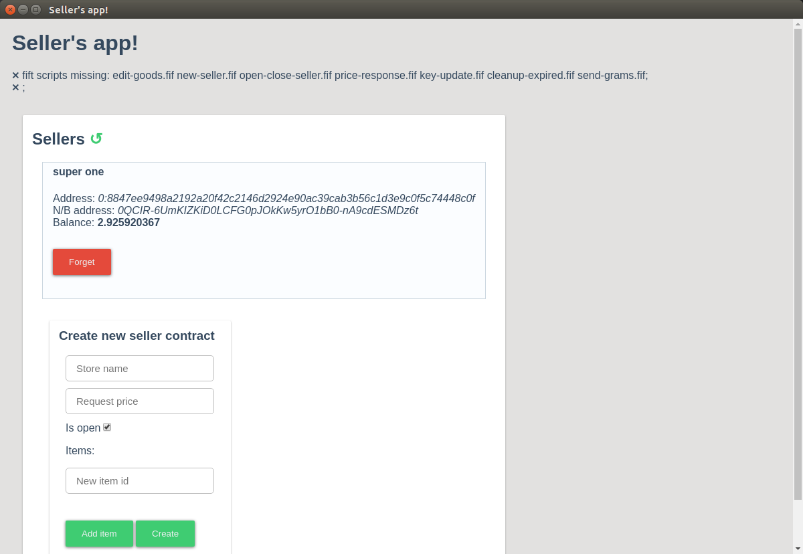

Start with the creation of a new seller:

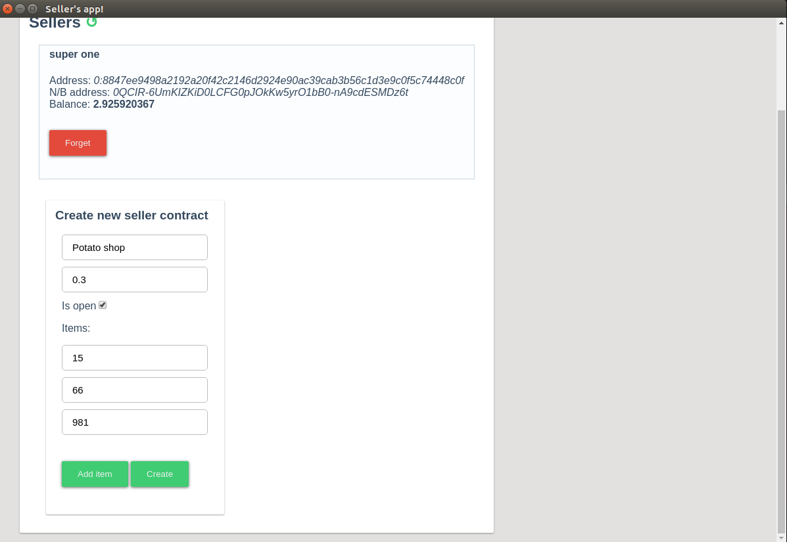

Then transfer some funds to the seller contract address (0QCgqx2qngtLwY9T07J4Nh-UNO8FGSnQ_tP4sgoxZEVfu-56)[https://test.ton.org/testnet/account?account=0QCgqx2qngtLwY9T07J4Nh-UNO8FGSnQ_tP4sgoxZEVfu-56]. After that click "Deploy".

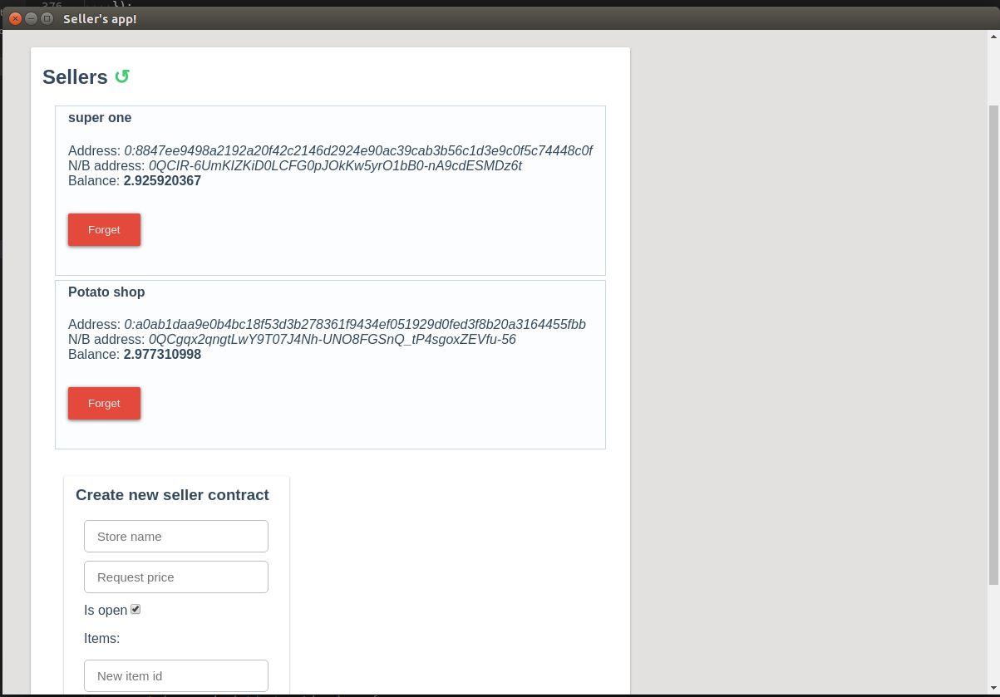


When the **Potato eater** created below sent the request to our seller, the client appears below:

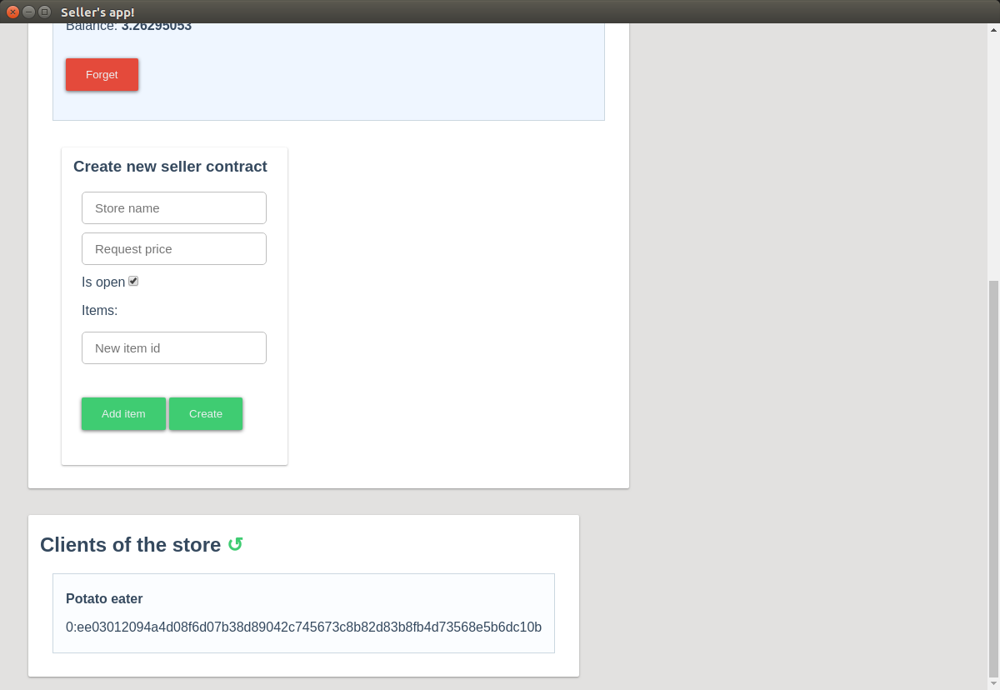

We may click on it and see his requests. The goods that are not know to our store are automatically removed and we see only the products that we sell:

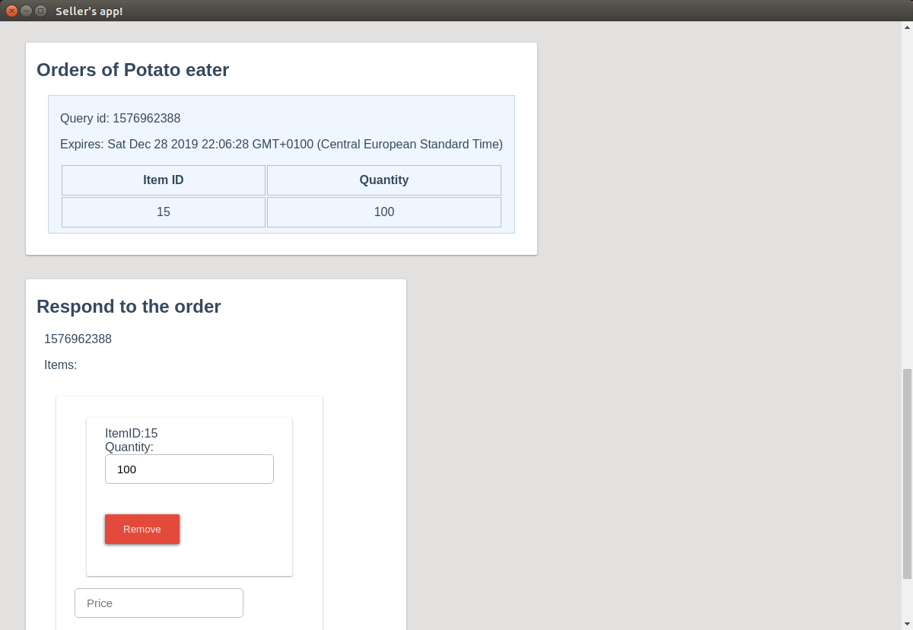

We may change the quantity of the estimated product if we don't have enough and estimate the price for all the order and send it back:

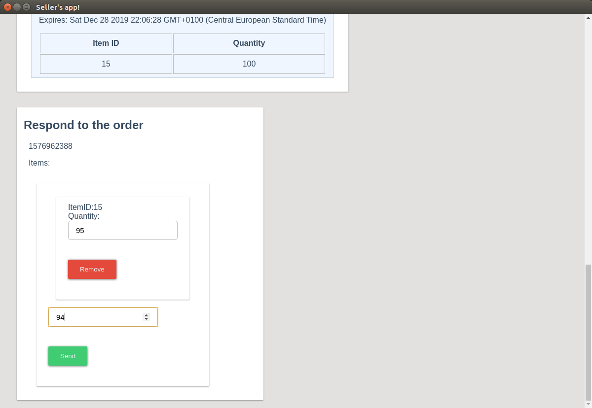

The request then will disappear from the list of the Potato eater's requests.

### Buyer's app

Configuration is the same as for the seller's app, the only difference is that `"fift-folder"` may be different.

Start with the creation of a new buyer:

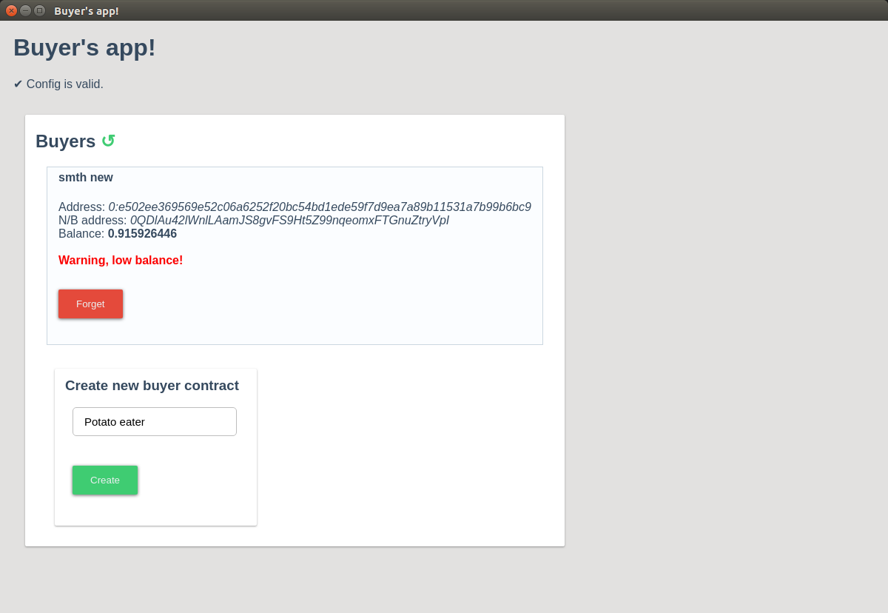

Transfer funds to it's address (0QDuAwEglKTQj20Hs42JBCx0VnPIuC2DuPtNc1aOW23BCzXa)[[https://test.ton.org/testnet/account?account=0QDuAwEglKTQj20Hs42JBCx0VnPIuC2DuPtNc1aOW23BCzXa] and click "Deploy"

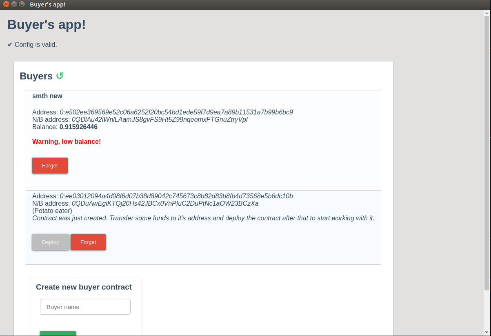


We may now select a new buyer, scroll down and create a new request. We may add several items to the request and provide the required quantity of each:

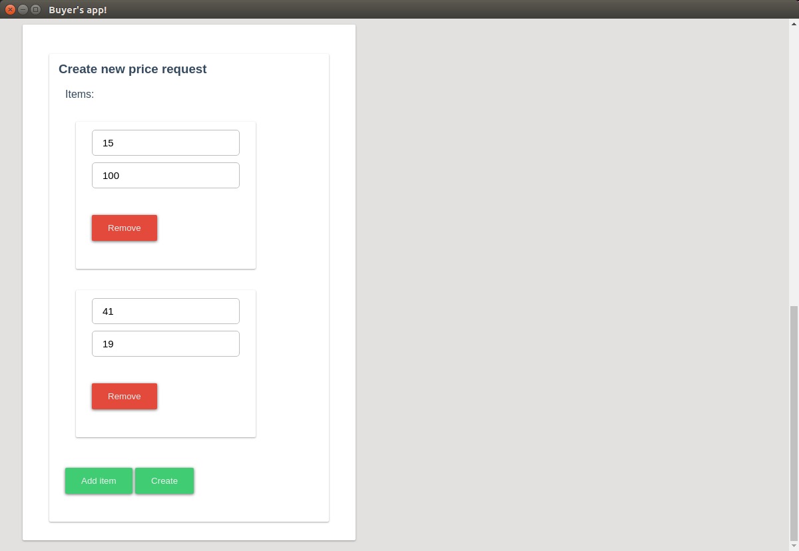

We can now see and select the new request:

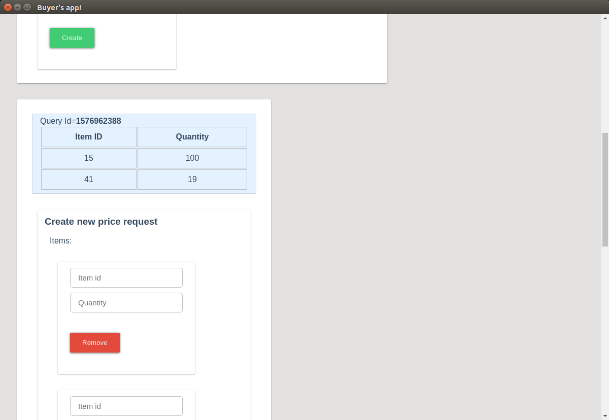

When selected the request - we may send it to the seller. We need to give sellers's addres (without workchain) and get it's info - it's name, if it is open and request estimation price. We'll use the **Potato shop** created above, it's address is 0:a0ab1daa9e0b4bc18f53d3b278361f9434ef051929d0fed3f8b20a3164455fbb but we need only a0ab1daa9e0b4bc18f53d3b278361f9434ef051929d0fed3f8b20a3164455fbb part.

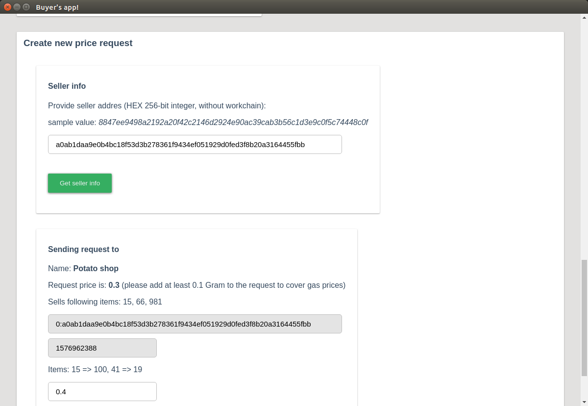

Now all the fields needed to send the price request to seller are prepopulated, so let's do it!

When the seller will send response, it will appear below.

## Final remarks

The applications code is pretty ugly because I didn't want to spend time for it now, preferring to give more attention to the smartcontract's code - fift and func. So please don't judge UI and my javaScript in these submissions - I know that it's horrible and before giving the applications to the real users I'll write much better code and do also much better UI. Applications in the current form are only proof of concepts and not all possibilities that are implemented in the smart contracts and fift scripts present in the apps.